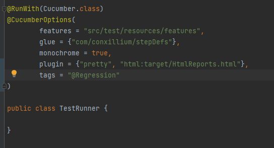

Conxillium Cucumber Selenium Java Framework

Pre requisites

* JAVA `11.0.8` is installed and `JAVA_HOME` and `Path` Environment variables are setup
* Apache Maven `3.9.4`  is installed and `MAVEN_HOME` and `Path` Environment variables are setup

Run the framework

* Clone the repo: https://github.com/HSGunawardena/conxilliumCucumberFramework.git
or download the zip file and unzip in local PC
* Use `mvn clean package install` to setup the framework
* Use `mvn clean test` to run the tests
* In case user needs to run specific group of tests, use below tags to run specific test files
  * @Smoke @Regression @Login @Home @NewRecords
* Please use one or many of these tags to run specific group or multiple group
* Add the needed tag in [TestRunner](src/test/java/com/conxillium/stepDefs/TestRunner.java) class against the "tag" key
  * 

Note: If you use an IDEA, you can run it through IntelliJ, Eclipse or your desired IDEA 